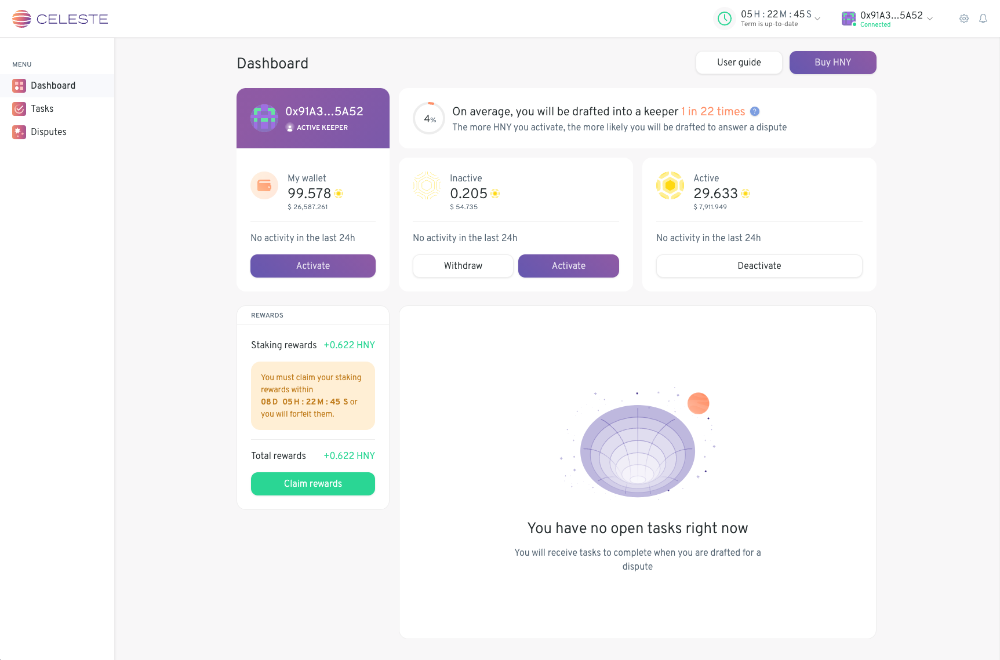

# Celeste Dashboard 

### Celeste handles subjective disputes requiring judgment from human keepers.

- 📚 Read the [User Guide](https://1hive.gitbook.io/celeste/) first, if you have any questions as a user.
- 📝 Please report any issues and feedback in the [1Hive discord channels](https://discord.com/invite/4fm7pgB).
- 🔧 For technical discussions, use this project's [issues](https://github.com/1hive/celeste-dashboard/issues)
- 📖 To learn more about contributing to Celeste Dashboard, please check the [contributing guide](./CONTRIBUTING.md)

## Quick start

- Install dependencies: `yarn`
- Start the app:
 `yarn start` will launch the app, configured to connect to our Rinkeby deployment.
  
  For connecting to other chains / deployments, a few useful npm scripts are provided:
   - xDai: `yarn start:xdai` will launch the app, configured to connect to Celeste's xDai deployment
   - Local: `yarn start:local` will launch the app, configured to connect to the local devchain.

Other [configuration options](docs/CONFIGURATION.md) are also available.

### Local development:

In order to start the dashboard locally, you will need to setup a few processes first.
  - Start ganache devchain
  - Deploy contracts to devchain
  - Deploy subgraph instance

 _For a detailed guide on how to achieve this, see more instructions [here](https://github.com/1hive/celeste-subgraph)._

You can also setup the [court services](https://github.com/1hive/celeste-backend/tree/master/packages/services), which include some automation for penalty settlements and heartbeats.

To start populating Celeste with disputes, you can use the [CLI tool](https://github.com/1hive/celeste-backend/tree/master/packages/cli).

## Contributing

#### 👋 Get started contributing with a [good first issue](https://github.com/1hive/celeste-dashboard/issues?q=is%3Aissue+is%3Aopen+label%3A%22good+first+issue%22).

Don't be shy to contribute even the smallest tweak. There are still some meteorites to be aware of, but we'll be here to help you get started!

For other details about contributing here, more information is available in the [contributing guide](./CONTRIBUTING.md).

#### Issues

If you come across an issue with the Celeste Dashboard, do a search in the [Issues](https://github.com/1hive/celeste-dashboard/issues?q=is%3Aissue+is%3Aopen) tab of this repo to make sure it hasn't been reported before. Follow these steps to help us prevent duplicate issues and unnecessary notifications going to the many people watching this repo:

- If the issue you found has been reported and is still open, and the details match your issue, give a "thumbs up" to the relevant posts in the issue thread to signal that you have the same issue. No further action is required on your part.
- If the issue you found has been reported and is still open, but the issue is missing some details, you can add a comment to the issue thread describing the additional details.
- If the issue you found has been reported but has been closed, you can comment on the closed issue thread and ask to have the issue reopened because you are still experiencing the issue. Alternatively, you can open a new issue, reference the closed issue by number or link, and state that you are still experiencing the issue. Provide any additional details in your post so we can better understand the issue and how to fix it.
